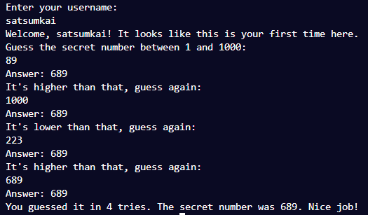
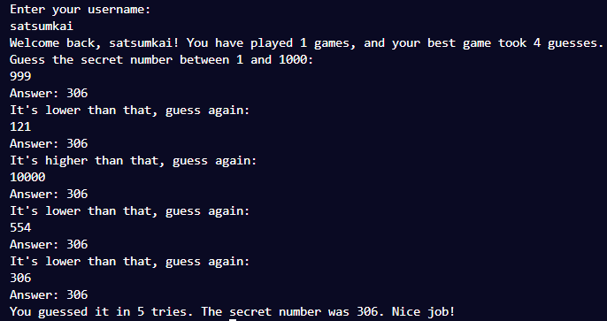

# Number Guessing Game - FreeCodeCamp Relational Database Certification

### Description
The aim of this project is to simulate a number guessing game utilizing a **Bash** program; users who play this game are updated via a **PostgreSQL** database. This database contains information such as username, the total games they have played, the number of guesses to complete their game, etc. Additionally, progress was tracked through the use of **Git**.

### Running Program
Dump and rebuild the database using the following command in the terminal: *psql -U postgres < number_guess.sql*. Run the program in the terminal using **./number_guess.sh** without an input. Input a username and start guessing a number between the specified range of 1 to 1000. Once you have guessed the number, your overall information will update in the database.  

### Sample Inputs & Outputs
*For the sake of these examples, the random number is shown to the user. In actual program, random number is hidden.*

**Example 1:**

**Example 2:**

### Database After Inputs
*Ignore username **scmeeerrr**, done for testing program before README.md*

